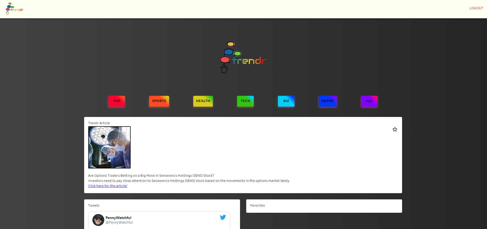
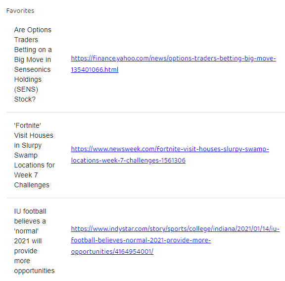

# trendr

## Table of Contents
  :camera:[Live](#live)  
  📜[Description](#description)  
  💻[Technology](#technology)  
  👥[Contributors](#contributors)  
  📱 [Contact](#contact)

## Live :camera: 

Check out the deployed Trendr app <a href="https://trendr-react.herokuapp.com/">here</a>!

## Description :page_with_curl:

You tired of Reddit regurgitating the same old gifs? You interested in Twitter, but the tweets are always monotone & lacking focus? Allow us to usher in the era of Trendr, an all-in-one dashboard that pulls the most relevant data on seven distinct categories based on Google Trends data, and gives you all the information and social buzz in one place. No longer will you fumble around looking for the right app to fill the void, Trendr is here to comfort you. If you haven't already, give the hyperlink above a visit, and connect with the collaborators below.

## Technology :computer:
Preparation & Execution: Figma (wireframing), GitHub Projects (management), Slack & Zoom (coordination).  
Frontend: React.js, Material-UI Bootstrap.  
Backend: Node.js, Express, MongoDB; Google Trends API, Twitter API.  
File Management & Hosting: Github, Heroku.  
Authentication: Google OAuth (firebase).

## Contributors :milky_way:

Get to know our engineers & keep up with their latest updates via GitHub:

 
Desmond Aldridge - Backend Engineer Savant, Google Authentication, Database Init

 
Paul Morales - Rendering Frontend Data (Article, Favorites), Database Setup

 
Bradley Guidry - Google Trends / Twitter API Engineer, Concept, Wireframe, Logo

 
Cooper Ahearn - React.js Engineer, Heroku Host, Frontend Design, GitHub Overseer

## Contact :email:

Connect with & contact the engineers directly via LinkedIn:

:dvd: Desmond - <a href="https://github.com/DesmondAldridge">DesmondAldridge</a> :dvd:  
:cd: Paul - <a href="https://github.com/paulmorales7">paulmorales7</a> :cd:  
:dvd: Bradley - <a href="https://www.linkedin.com/in/bradley-guidry-076298187/">bradley-guidry</a> :dvd: 
:cd: Cooper - <a href="https://www.linkedin.com/in/lcahearn/">LCAhearn</a> :cd: 